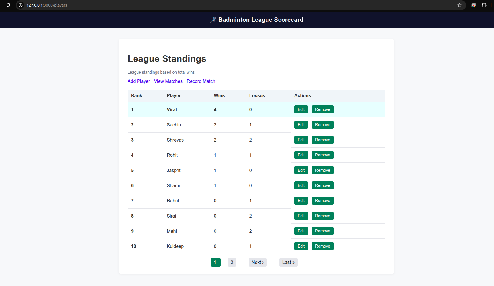
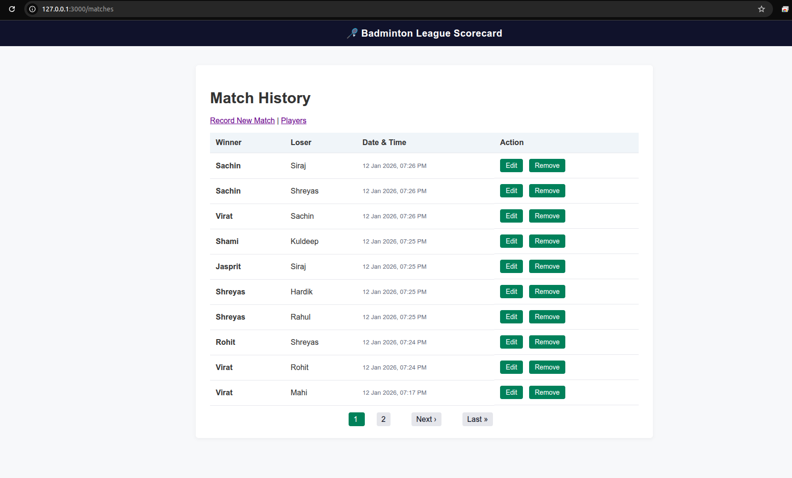

# Badminton League

A Rails-based web application for managing a badminton league. Track players, record match results, and view player statistics.

## Overview

The Badminton League application provides a simple interface to:

- Manage player profiles
- Record match results (winner/loser)
- View player win/loss statistics
- Track league standings

## Technology Stack

- **Framework**: Ruby on Rails 7.1.5
- **Language**: Ruby 3.0.0
- **Database**: PostgreSQL
- **Frontend**: HTML & CSS
- **Server**: Puma

## Project Structure

```
app/
├── controllers/        # Application controllers
├── models/            # Player and Match models
├── views/             # HTML templates
└── assets/            # CSS and images

config/
├── routes.rb          # Application routes
├── database.yml       # Database configuration
└── environments/      # Environment-specific settings

db/
├── migrate/           # Database migrations
└── schema.rb          # Database schema

```

## Screenshots

### Players List



### Matches



## Features

### Players

- Create, read, update, and delete player profiles
- View all players in the league
- Track player statistics (wins/losses)

### Matches

- Record match results between players
- View match history
- Update or delete match records
- Validation ensures winner and loser are different players

## Database Schema

### Players Table

- `id`: Integer (Primary Key)
- `name`: String (Unique, Required)
- Created/Updated timestamps

### Matches Table

- `id`: Integer (Primary Key)
- `winner_id`: Integer (Foreign Key - Players)
- `loser_id`: Integer (Foreign Key - Players)
- Created/Updated timestamps

## Getting Started

### Prerequisites

- Ruby 3.0.0
- PostgreSQL

### Installation

1. Clone the repository

```bash
git clone <repository-url>
cd badminton_league
```

2. Install dependencies

```bash
bundle install
```

3. Setup database

```bash
rails db:create
rails db:migrate
rails db:seed
```

4. Start the server

```bash
rails s
```

The application will be available at `http://localhost:3000`

## API Routes

### Players

- `GET /players` - List all players
- `GET /players/new` - New player form
- `POST /players` - Create a player
- `GET /players/:id/edit` - Edit player form
- `PATCH /players/:id` - Update a player
- `DELETE /players/:id` - Delete a player

### Matches

- `GET /matches` - List all matches
- `GET /matches/new` - New match form
- `POST /matches` - Create a match
- `GET /matches/:id/edit` - Edit match form
- `PATCH /matches/:id` - Update a match
- `DELETE /matches/:id` - Delete a match

### Root

- `GET /` - Redirects to players list

## Development

### Running Tests

```bash
rails test
```

### Database Management

```bash
# Create database
rails db:create

# Run migrations
rails db:migrate

# Seed database
rails db:seed

# Drop database
rails db:drop
```

### Debugging

Use the `debug` gem for debugging in development and test environments.
